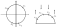

### Hledání největšího vlastního čísla hermitovské části intervalové matice s otočenými prvky

Hledáme $\max \:\{\lambda_1(H(e^{i\varphi}A));\: A \in \boldsymbol{A}\}$, kde $\boldsymbol{A} \in \mathbb{IR}^{nxn}$ je zadaná pomocí $\underline{A}$ a $\overline{A}$. Ať $A^\prime$ je taková hermitovská část otočené matice vzniklé z $A \in \boldsymbol{A}$. Pak
$$
a^\prime_{ij} = \frac{ e^{i\varphi}a_{ij}\: +\: e^{-i\varphi}a_{ji}}{2}
$$
Matice jsou hermitovské, nabízí se, jestli by se nějak nemohl modifikovat algoritmus na nalezení největšího vlastního čísla symetrických intervalových matic (Theorem 4.36 v *Bounds on eigenvalues of real and complex interval matrices*). Nejlépe se stejnou složitostí $O(2^n)$ (složitost zde není počet operací, ale počet hledání největších vlastních čísel matic). 

Idea je, že největší vlastní číslo obsahuje matice, jejíž prvky jsou krajní hodnoty intervalů, ve kterých prvky mohou ležet. Pro symetrické matice je největší vlastní číslo maximum z vlastních čísel matic $\{A;\: A \in A_{-z,z}\}$. U symetrických matic je sjednocení možných hodnot pro $a_{ij} = a_{ji}$ reálný interval. U $A^\prime$ je sjednocení hodnot pro $a^\prime_{ij} = \overline{a^\prime_{ji}}$ rovnoběžník v komplexní rovině:
$$
\left\{\frac{u+v}2;\: u= e^{i\varphi}a_{ij}\and v= e^{-i\varphi}a_{ji}\and a_{ij}\textrm{ a } a_{ji}\textrm{ z reálných intervalů}\right\}
$$
Kdybychom vzali jen matice, které budou mít hodnoty prvků vždy v jednom ze čtyř vrcholů rovnoběžníku pro daný prvek (je jich $O(2^{n^2})$ ), jde dokázat, že jedna z těchto matic bude obsahovat největší vlastní číslo. Sporem nechť $A$ má $\lambda_1(A)$ větší než všechny takové matice. Hledáme matici $A'$ s prvky ve vrcholech rovnoběžníků, která splňuje následující nerovnost:
$$
\lambda_1(A) = Re(x^*Ax) = Re\left( \sum_{i,j=1}^n x_i^*x_jA_{ij}\right) \le 
Re\left( \sum_{i,j=1}^n x_i^*x_jA_{ij}^{\prime}\right)
$$
Využívá se toho, že vlastní čísla hermitovských matic jsou reálné. Pro $i \ge j$ bude $A_{ij}$ někde uvnitř nebo na hranici příslušného rovnoběžníku.
$$
Re(x_i^*x_jA^{\prime}_{ij}) = Re(x_i^*x_j)Re(A^{\prime}_{ij}) + Im(x_i^*x_j)Im(A^{\prime}_{ij})\
$$
Pokud bereme předchozí výraz jako lineární účelovou funkci a hledáme její maximum pro $A^\prime_{ij}$ na konvexním mnohostěnu (rovnoběžníku), bude maximum v jednom z jeho čtyř vrcholů.  $A^{\prime}_{ij}$ pode toho nastavíme, účelová funkce bude aspoň tak dobrá jako při dosazení $A_{ij}$. Zároveň máme $A^{\prime}_{ji} = \overline{A^{\prime}_{ij}}$, u prvku sumy s $A^{\prime}_{ji}$ bude nerovnost také splněna, protože bereme jen reálné části a ty jsou stejné jako u nerovnosti s $A^{\prime}_{ij}$. Celkem:
$$
Re\left( \sum_{i,j=1}^n x_i^*x_jA_{ij}\right) \le 
Re\left( \sum_{i,j=1}^n x_i^*x_jA_{ij}^{\prime}\right) = Re(x^*A^{\prime}x) \le \max_{y: \|y\|_2 = 1} y^*A^{\prime}y = \lambda_1(A^{\prime})
$$
Poslední rovnost pro hermitovské matice platí. Dostáváme spor.

Nemusíme testovat všechny matice. U $x_i^*x_iA^\prime_{ii}$ bude koeficient vždy kladný a $A^\prime_{ii}$ může nabývat hodnoty jen z reálného intervalu. Proto stačí testovat jen matice, pro které bude diagonála nejvyšší možná.

#### Jiný algoritmus

Pokud vezmeme vektor $x$ z předchozího důkazu, jde využít jeho vlastností a netestovat všech $O(2^{n^2})$ matic. Nejdřív ať $\varphi \in [0, \pi/2)$. Definujeme $\alpha := \pi/2 - \varphi$. Když rozdělíme konvexní rovinu dvěma přímkami procházejícími počátkem, jednu kolmou na $u$, druhou na $v$ (v obrázku přerušované čáry), dostaneme čtyři souvislé oblasti. Každá z nich odpovídá jednomu vrcholu rovnoběžníku (když $x_i^*x_j$ bude v oblasti, maximum se bude nabývat v k ní příslušném vrcholu). 

Pro přehlednost je rovnoběžník posunutý do počátku. Označme $\gamma$ úhel, který svírá  $x_i^*x_j$ s reálnou osou. Když například $\pi - \alpha \le \gamma \le \pi + \alpha$ , bude maximum účelové funkce po dosazení  $x_i^*x_j$ v levém vrcholu lichoběžníku. Příslušné prvky matice $A^\prime$ se pak mohou nastavit tak, aby byla účelová funkce pro $A^\prime$ nejvyšší možná.

Pro nastavení matice $A^\prime$ je nutné vědět, do kterého ze čtyř intervalů úhly $\gamma$ patří. Takových úhlu je $n^2$. Jak se ukáže později, vektorů $x$, pro které jsou úhly v různých intervalech, je ale asymptoticky méně než $4^{n^2}$.

Vezmeme složky vektoru $x$ a ty se zápornou složkou otočíme o $180^{\circ}$ okolo počátku. Předpokládejme, že o všech dvojicích takto získaných bodů víme, jestli pro úhel $\gamma^\prime$, který spolu svírají, platí $ \gamma^\prime \ge \alpha$ a jestli platí  $\gamma^\prime \ge \pi - \alpha$. Když k tomu přidáme informaci, které body byly otočeny a které ne, jdou odvodit příslušné intervaly pro všechny úhly $\gamma$. Například když $\gamma^\prime$ pro $x_i^*x_j$ je menší než $\alpha$ a jeden z bodů byl otočený a druhý ne, $\gamma$ bude patřit do intervalu popsaného výše (maximum bude v levém vrcholu). Pokud byly oba body otočeny nebo nebyl otočený žádný z nich, maximum bude v pravém rohu. Další případy se vyřeší podobně.

Matic, které je potřeba otestovat, bude $O(2^nn!\binom{2n}nn)$. $2^n$ je možností jak otočit/neotočit prvky.  Odhad na počet různých velikostí úhlů $\gamma^\prime$ bude mírně nadhodnocený. Máme $n!$ možností, jak mohou být složky vektoru $x$ po otočení seřazeny za sebou na půlkružnici. $y_1, \dots,y_n$ budou takto seřazené body. Mezi body na polokružnici umístíme $n$ zarážek ($\binom{2n}n$ možností). Zvolíme jednu zarážku ($n$ možností) tak, aby všechny body mezi $y_1$a zarážkou měly úhel $\gamma^\prime$ s  $y_1$ menší než $\alpha$ a za zarážkou jej měly větší. Pro $y_2$ a zarážku následující hned po zvolené bude platit totéž. Pokračujeme pro všechny body. V určitém bodě zarážky již nevystačí a místo toho se popořadě budou brát od zarážek s nejmenším úhlem, až se dostanou k původní zarážce pro $y_1$. Pro body na začátku půlkružnice před zarážkou bude platit $\gamma^\prime \ge \pi - \alpha$. Pro každé rozmístění bodů na polokružnici existuje kombinace zarážek, ze které se dají získat stejné výsledky pro úhly $\gamma^\prime$ (stačí postupně umísťovat zarážky pro $y_1, \dots,y_n$). Některé kombinace zarážek nebudou odpovídat žádnému skutečnému rozmístění bodů.

Zbývá vyřešit případy, kdy $\varphi \gt \pi/2$.  To jde převést na předchozí případ, kde $\varphi^\prime \le \pi/2$ bude polovina velikosti levého vnitřního úhlu lichoběžníku. Pak je ale nutné jinak nastavit prvky v matici, z jejíž hermitovské části po otočení se dostává $A^\prime$. Rozliší se 4 případy podle velikosti $\varphi$. Když se například pro $\varphi \lt \pi/2$ maximum nabývá v levém rohu, tak $a_{ij}$ i $a_{ji}$ budou minimální, tedy z  $\underline{A}$. Pro $\pi \ge \varphi \gt \pi/2$ se do levého rohu dostaneme tak, že $a_{ij}$ a $a_{ji}$ budou maximální (z  $\underline{A}$). Jiné nebo stejné hodnoty bude potřeba volit pro ${3\over2}\pi \ge \varphi \gt \pi/2$ a $2\pi \ge \varphi \gt {3\over2} \pi$.